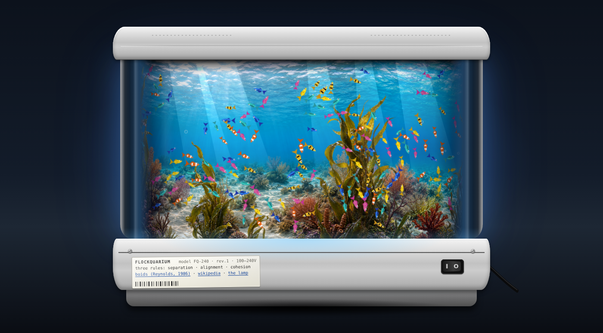
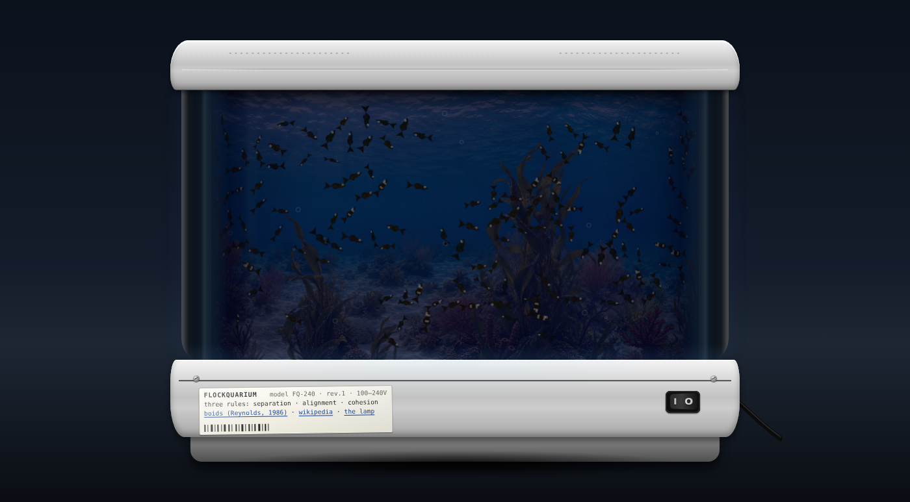
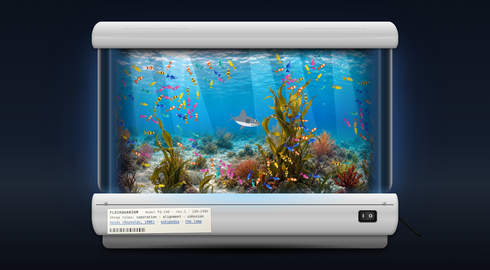
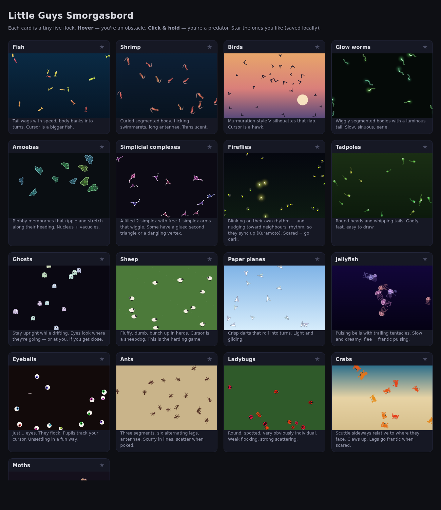
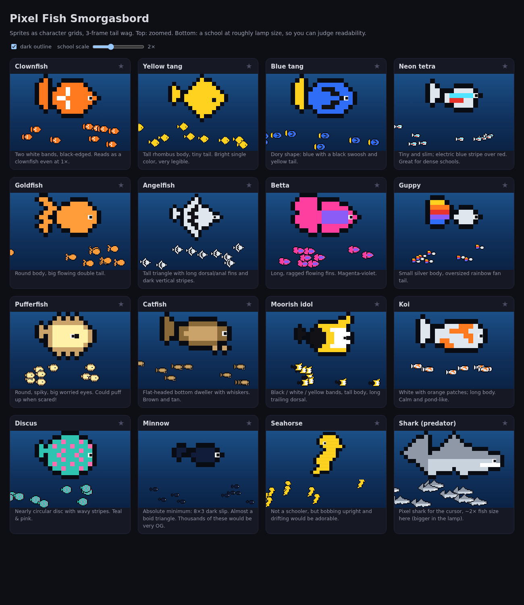

# Flockquarium

A browser toy: one of those rotating aquarium lamps, except the fish are real boids.



The back of the "tank" is a slowly turning drum with a two-layer reef panorama on it.
In front of it, 240 fish flock using Craig Reynolds' original three rules — separation,
alignment, cohesion — and nothing else clever. Your cursor is part of the tank.

There is no instructions text on the page on purpose. Poke around.

## Run it

It's a single HTML file with no build step and no dependencies.

```sh
git clone https://github.com/brezgis/flockquarium
cd flockquarium
python3 -m http.server 8000
# open http://localhost:8000/
```

(Serving over HTTP rather than `file://` matters only so the browser will load the panorama images.)

## What's in here

| File | What |
|---|---|
| `flockquarium.html` | The lamp. `index.html` and `lamp.html` just redirect to it. |
| `panorama-1..3.png` | Back drum layer: three 1536×1024 reef panels, stitched into a ring with cross-faded seams. |
| `foreground-1..3.png` | Front drum layer: transparent kelp/coral panels that roll 1.6× faster for parallax. |
| `smorgasbord.html` | The creature tryouts that came before the fish — 17 kinds of little guys, each a live mini-flock. |
| `pixelfish.html` | A pixel-art fish sprite sheet, in case the lamp ever goes 8-bit. |
| `screenshots/` | These pictures. |





## How the drum works

The drum is modelled as an oval cylinder (ellipse cross-section, depth 0.35 × half-width)
viewed head-on. The panorama is drawn in 3 px vertical strips, each strip sampling the
texture by *arc length* along the ellipse — so the middle scrolls almost flat and the
edges compress and darken as the drum curves away, like the real lamp.

The fish live on the same ring: a visible front arc plus a hidden back arc. Neighbour
lookups are wrap-aware, so a school that swims off the right edge keeps flocking behind
the drum and comes back on the left still a school. Fish squash horizontally as they
slide around the edge.

## The flocking

Textbook Reynolds steering: each rule produces a desired velocity, the steering force is
`desired − velocity` capped at a max force. Boids only see neighbours inside a ~250°
field of view. On top of that, each fish has a preferred direction (75% right, 25% left)
so opposing schools form and pass through each other, plus soft walls at the surface and
sand. The knobs live in the `P` object near the top of the script.

Light off: room goes dark, fish become silhouettes with a bit of eye-shine and get drowsy.

## Other tryouts

<p>


</p>

## Credits

- Boids: Craig Reynolds, [*Flocks, Herds, and Schools* (1986)](https://www.red3d.com/cwr/boids/)
- Reef panels generated with ChatGPT image generation
- Inspired by the plastic aquarium motion lamps you find at the back of a gift shop
